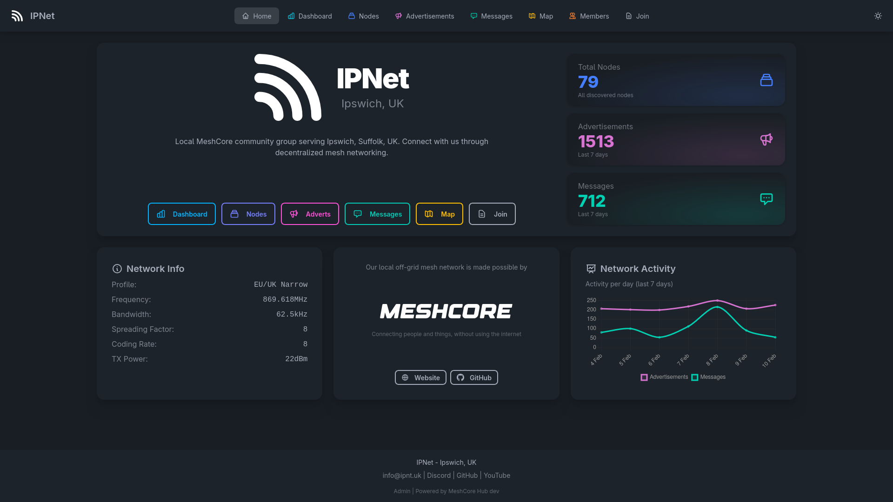
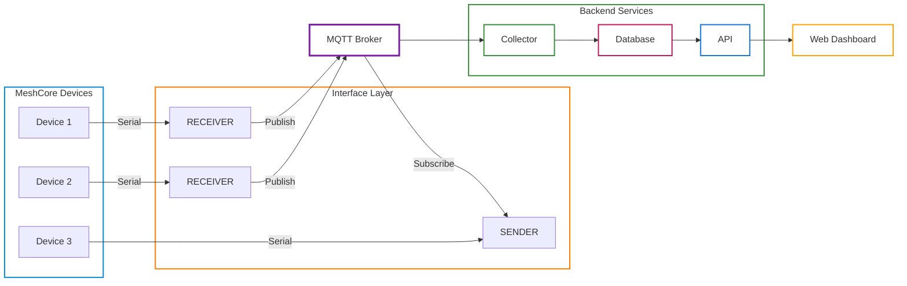
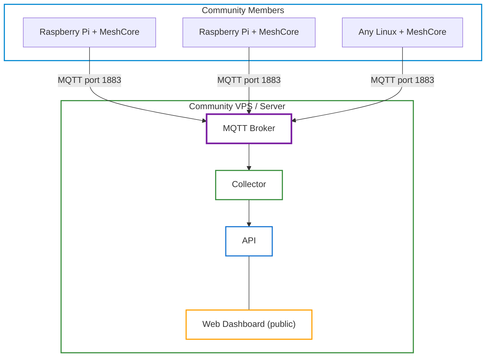

# MeshCore Hub

Python 3.13+ platform for managing and orchestrating MeshCore mesh networks.



## Overview

MeshCore Hub provides a complete solution for monitoring, collecting, and interacting with MeshCore mesh networks. It consists of multiple components that work together:

| Component | Description |
|-----------|-------------|
| **Interface** | Connects to MeshCore companion nodes via Serial/USB, bridges events to/from MQTT |
| **Collector** | Subscribes to MQTT events and persists them to a database |
| **API** | REST API for querying data and sending commands to the network |
| **Web Dashboard** | User-friendly web interface for visualizing network status |

## Architecture



## Features

- **Multi-node Support**: Connect multiple receiver nodes for better network coverage
- **Event Persistence**: Store messages, advertisements, telemetry, and trace data
- **REST API**: Query historical data with filtering and pagination
- **Command Dispatch**: Send messages and advertisements via the API
- **Node Tagging**: Add custom metadata to nodes for organization
- **Web Dashboard**: Visualize network status, node locations, and message history
- **Docker Ready**: Single image with all components, easy deployment

## Getting Started

### Simple Self-Hosted Setup

The quickest way to get started is running the entire stack on a single machine with a connected MeshCore device.

**Prerequisites:**
1. Flash the [USB Companion firmware](https://meshcore.dev/) onto a compatible device (e.g., Heltec V3, T-Beam)
2. Connect the device via USB to a machine that supports Docker or Python

**Steps:**
```bash
# Create a directory, download the Docker Compose file and
# example environment configuration file

mkdir meshcore-hub
cd meshcore-hub
wget https://raw.githubusercontent.com/ipnet-mesh/meshcore-hub/refs/heads/main/docker-compose.yml
wget https://raw.githubusercontent.com/ipnet-mesh/meshcore-hub/refs/heads/main/.env.example

# Copy and configure environment
cp .env.example .env
# Edit .env: set SERIAL_PORT to your device (e.g., /dev/ttyUSB0 or /dev/ttyACM0)

# Start the entire stack with local MQTT broker
docker compose --profile mqtt --profile core --profile receiver up -d

# View the web dashboard
open http://localhost:8080
```

This starts all services: MQTT broker, collector, API, web dashboard, and the interface receiver that bridges your MeshCore device to the system.

### Distributed Community Setup

For larger deployments, you can separate receiver nodes from the central infrastructure. This allows multiple community members to contribute receiver coverage while hosting the backend centrally.



**On each receiver node (Raspberry Pi, etc.):**
```bash
# Only run the receiver component
# Configure .env with MQTT_HOST pointing to your central server
MQTT_HOST=your-community-server.com
SERIAL_PORT=/dev/ttyUSB0

docker compose --profile receiver up -d
```

**On the central server (VPS/cloud):**
```bash
# Run the core infrastructure with local MQTT broker
docker compose --profile mqtt --profile core up -d

# Or connect to an existing MQTT broker (set MQTT_HOST in .env)
docker compose --profile core up -d
```

This architecture allows:
- Multiple receivers for better RF coverage across a geographic area
- Centralized data storage and web interface
- Community members to contribute coverage with minimal setup
- The central server to be hosted anywhere with internet access

## Deployment

### Docker Compose Profiles

Docker Compose uses **profiles** to select which services to run:

| Profile | Services | Use Case |
|---------|----------|----------|
| `core` | collector, api, web | Central server infrastructure |
| `receiver` | interface-receiver | Receiver node (events to MQTT) |
| `sender` | interface-sender | Sender node (MQTT to device) |
| `mqtt` | mosquitto broker | Local MQTT broker (optional) |
| `mock` | interface-mock-receiver | Testing without hardware |
| `migrate` | db-migrate | One-time database migration |
| `seed` | seed | One-time seed data import |

**Note:** Most deployments connect to an external MQTT broker. Add `--profile mqtt` only if you need a local broker.

```bash
# Create database schema
docker compose --profile migrate run --rm db-migrate

# Seed the database
docker compose --profile seed run --rm seed

# Start core services with local MQTT broker
docker compose --profile mqtt --profile core up -d

# Or connect to external MQTT (configure MQTT_HOST in .env)
docker compose --profile core up -d

# Start just the receiver (connects to MQTT_HOST from .env)
docker compose --profile receiver up -d

# View logs
docker compose logs -f

# Stop services
docker compose down
```

### Serial Device Access

For production with real MeshCore devices, ensure the serial port is accessible:

```bash
# Check device path
ls -la /dev/ttyUSB*

# Add user to dialout group (Linux)
sudo usermod -aG dialout $USER

# Configure in .env
SERIAL_PORT=/dev/ttyUSB0
SERIAL_PORT_SENDER=/dev/ttyUSB1  # If using separate sender device
```

### Manual Installation

```bash
# Create virtual environment
python -m venv .venv
source .venv/bin/activate

# Install the package
pip install -e ".[dev]"

# Run database migrations
meshcore-hub db upgrade

# Start components (in separate terminals)
meshcore-hub interface --mode receiver --port /dev/ttyUSB0
meshcore-hub collector
meshcore-hub api
meshcore-hub web
```

## Configuration

All components are configured via environment variables. Create a `.env` file or export variables:

### Common Settings

| Variable | Default | Description |
|----------|---------|-------------|
| `LOG_LEVEL` | `INFO` | Logging level (DEBUG, INFO, WARNING, ERROR) |
| `DATA_HOME` | `./data` | Base directory for runtime data |
| `SEED_HOME` | `./seed` | Directory containing seed data files |
| `MQTT_HOST` | `localhost` | MQTT broker hostname |
| `MQTT_PORT` | `1883` | MQTT broker port |
| `MQTT_USERNAME` | *(none)* | MQTT username (optional) |
| `MQTT_PASSWORD` | *(none)* | MQTT password (optional) |
| `MQTT_PREFIX` | `meshcore` | Topic prefix for all MQTT messages |
| `MQTT_TLS` | `false` | Enable TLS/SSL for MQTT connection |

### Interface Settings

| Variable | Default | Description |
|----------|---------|-------------|
| `SERIAL_PORT` | `/dev/ttyUSB0` | Serial port for MeshCore device |
| `SERIAL_BAUD` | `115200` | Serial baud rate |
| `MESHCORE_DEVICE_NAME` | *(none)* | Device/node name set on startup (broadcast in advertisements) |

### Webhooks

The collector can forward certain events to external HTTP endpoints:

| Variable | Default | Description |
|----------|---------|-------------|
| `WEBHOOK_ADVERTISEMENT_URL` | *(none)* | Webhook URL for advertisement events |
| `WEBHOOK_ADVERTISEMENT_SECRET` | *(none)* | Secret sent as `X-Webhook-Secret` header |
| `WEBHOOK_MESSAGE_URL` | *(none)* | Webhook URL for all message events |
| `WEBHOOK_MESSAGE_SECRET` | *(none)* | Secret for message webhook |
| `WEBHOOK_CHANNEL_MESSAGE_URL` | *(none)* | Override URL for channel messages only |
| `WEBHOOK_DIRECT_MESSAGE_URL` | *(none)* | Override URL for direct messages only |
| `WEBHOOK_TIMEOUT` | `10.0` | Request timeout in seconds |
| `WEBHOOK_MAX_RETRIES` | `3` | Max retry attempts on failure |
| `WEBHOOK_RETRY_BACKOFF` | `2.0` | Exponential backoff multiplier |

Webhook payload format:
```json
{
  "event_type": "advertisement",
  "public_key": "abc123...",
  "payload": { ... event data ... }
}
```

### Data Retention

The collector automatically cleans up old event data and inactive nodes:

| Variable | Default | Description |
|----------|---------|-------------|
| `DATA_RETENTION_ENABLED` | `true` | Enable automatic cleanup of old events |
| `DATA_RETENTION_DAYS` | `30` | Days to retain event data |
| `DATA_RETENTION_INTERVAL_HOURS` | `24` | Hours between cleanup runs |
| `NODE_CLEANUP_ENABLED` | `true` | Enable removal of inactive nodes |
| `NODE_CLEANUP_DAYS` | `7` | Remove nodes not seen for this many days |

### API Settings

| Variable | Default | Description |
|----------|---------|-------------|
| `API_HOST` | `0.0.0.0` | API bind address |
| `API_PORT` | `8000` | API port |
| `API_READ_KEY` | *(none)* | Read-only API key |
| `API_ADMIN_KEY` | *(none)* | Admin API key (required for commands) |

### Web Dashboard Settings

| Variable | Default | Description |
|----------|---------|-------------|
| `WEB_HOST` | `0.0.0.0` | Web server bind address |
| `WEB_PORT` | `8080` | Web server port |
| `API_BASE_URL` | `http://localhost:8000` | API endpoint URL |
| `WEB_ADMIN_ENABLED` | `false` | Enable admin interface at /a/ (requires auth proxy) |
| `NETWORK_NAME` | `MeshCore Network` | Display name for the network |
| `NETWORK_CITY` | *(none)* | City where network is located |
| `NETWORK_COUNTRY` | *(none)* | Country code (ISO 3166-1 alpha-2) |
| `NETWORK_RADIO_CONFIG` | *(none)* | Radio config (comma-delimited: profile,freq,bw,sf,cr,power) |
| `NETWORK_WELCOME_TEXT` | *(none)* | Custom welcome text for homepage |
| `NETWORK_CONTACT_EMAIL` | *(none)* | Contact email address |
| `NETWORK_CONTACT_DISCORD` | *(none)* | Discord server link |
| `NETWORK_CONTACT_GITHUB` | *(none)* | GitHub repository URL |

## Seed Data

The database can be seeded with node tags and network members from YAML files in the `SEED_HOME` directory (default: `./seed`).

#### Running the Seed Process

Seeding is a separate process and must be run explicitly:

```bash
docker compose --profile seed up
```

This imports data from the following files (if they exist):
- `{SEED_HOME}/node_tags.yaml` - Node tag definitions
- `{SEED_HOME}/members.yaml` - Network member definitions

#### Directory Structure

```
seed/                          # SEED_HOME (seed data files)
├── node_tags.yaml            # Node tags for import
└── members.yaml              # Network members for import

data/                          # DATA_HOME (runtime data)
└── collector/
    └── meshcore.db           # SQLite database
```

Example seed files are provided in `example/seed/`.

### Node Tags

Node tags allow you to attach custom metadata to nodes (e.g., location, role, owner). Tags are stored in the database and returned with node data via the API.

#### Node Tags YAML Format

Tags are keyed by public key in YAML format:

```yaml
# Each key is a 64-character hex public key
0123456789abcdef0123456789abcdef0123456789abcdef0123456789abcdef:
  friendly_name: Gateway Node
  role: gateway
  lat: 37.7749
  lon: -122.4194
  is_online: true

fedcba9876543210fedcba9876543210fedcba9876543210fedcba9876543210:
  friendly_name: Oakland Repeater
  altitude: 150
```

Tag values can be:
- **YAML primitives** (auto-detected type): strings, numbers, booleans
- **Explicit type** (when you need to force a specific type):
  ```yaml
  altitude:
    value: "150"
    type: number
  ```

Supported types: `string`, `number`, `boolean`

### Network Members

Network members represent the people operating nodes in your network. Members can optionally be linked to nodes via their public key.

#### Members YAML Format

```yaml
- member_id: walshie86
  name: Walshie
  callsign: Walshie86
  role: member
  description: IPNet Member
- member_id: craig
  name: Craig
  callsign: M7XCN
  role: member
  description: IPNet Member
```

| Field | Required | Description |
|-------|----------|-------------|
| `member_id` | Yes | Unique identifier for the member |
| `name` | Yes | Member's display name |
| `callsign` | No | Amateur radio callsign |
| `role` | No | Member's role in the network |
| `description` | No | Additional description |
| `contact` | No | Contact information |
| `public_key` | No | Associated node public key (64-char hex) |

## API Documentation

When running, the API provides interactive documentation at:

- **Swagger UI**: http://localhost:8000/api/docs
- **ReDoc**: http://localhost:8000/api/redoc
- **OpenAPI JSON**: http://localhost:8000/api/openapi.json

Health check endpoints are also available:

- **Health**: http://localhost:8000/health
- **Ready**: http://localhost:8000/health/ready (includes database check)

### Authentication

The API supports optional bearer token authentication:

```bash
# Read-only access
curl -H "Authorization: Bearer <API_READ_KEY>" http://localhost:8000/api/v1/nodes

# Admin access (required for commands)
curl -X POST \
  -H "Authorization: Bearer <API_ADMIN_KEY>" \
  -H "Content-Type: application/json" \
  -d '{"destination": "abc123...", "text": "Hello!"}' \
  http://localhost:8000/api/v1/commands/send-message
```

### Example Endpoints

| Method | Endpoint | Description |
|--------|----------|-------------|
| GET | `/api/v1/nodes` | List all known nodes |
| GET | `/api/v1/nodes/{public_key}` | Get node details |
| GET | `/api/v1/nodes/{public_key}/tags` | Get node tags |
| POST | `/api/v1/nodes/{public_key}/tags` | Create node tag |
| GET | `/api/v1/messages` | List messages with filters |
| GET | `/api/v1/advertisements` | List advertisements |
| GET | `/api/v1/telemetry` | List telemetry data |
| GET | `/api/v1/trace-paths` | List trace paths |
| POST | `/api/v1/commands/send-message` | Send direct message |
| POST | `/api/v1/commands/send-channel-message` | Send channel message |
| GET | `/api/v1/dashboard/stats` | Get network statistics |

## Development

### Setup

```bash
# Clone and setup
git clone https://github.com/ipnet-mesh/meshcore-hub.git
cd meshcore-hub
python -m venv .venv
source .venv/bin/activate
pip install -e ".[dev]"

# Install pre-commit hooks
pre-commit install
```

### Running Tests

```bash
# Run all tests
pytest

# Run with coverage
pytest --cov=meshcore_hub --cov-report=html

# Run specific test file
pytest tests/test_api/test_nodes.py

# Run tests matching pattern
pytest -k "test_list"
```

### Code Quality

```bash
# Run all code quality checks (formatting, linting, type checking)
pre-commit run --all-files
```

### Creating Database Migrations

```bash
# Auto-generate migration from model changes
meshcore-hub db revision --autogenerate -m "Add new field to nodes"

# Create empty migration
meshcore-hub db revision -m "Custom migration"

# Apply migrations
meshcore-hub db upgrade
```

## Project Structure

```
meshcore-hub/
├── src/meshcore_hub/       # Main package
│   ├── common/             # Shared code (models, schemas, config)
│   ├── interface/          # MeshCore device interface
│   ├── collector/          # MQTT event collector
│   ├── api/                # REST API
│   └── web/                # Web dashboard
├── tests/                  # Test suite
├── alembic/                # Database migrations
├── etc/                    # Configuration files (mosquitto.conf)
├── example/                # Example files for testing
│   └── seed/               # Example seed data files
│       ├── node_tags.yaml  # Example node tags
│       └── members.yaml    # Example network members
├── seed/                   # Seed data directory (SEED_HOME, copy from example/seed/)
├── data/                   # Runtime data directory (DATA_HOME, created at runtime)
├── Dockerfile              # Docker build configuration
├── docker-compose.yml      # Docker Compose services
├── PROMPT.md               # Project specification
├── SCHEMAS.md              # Event schema documentation
├── PLAN.md                 # Implementation plan
├── TASKS.md                # Task tracker
└── AGENTS.md               # AI assistant guidelines
```

## Documentation

- [PROMPT.md](PROMPT.md) - Original project specification
- [SCHEMAS.md](SCHEMAS.md) - MeshCore event schemas
- [PLAN.md](PLAN.md) - Architecture and implementation plan
- [TASKS.md](TASKS.md) - Development task tracker
- [AGENTS.md](AGENTS.md) - Guidelines for AI coding assistants

## Contributing

1. Fork the repository
2. Create a feature branch (`git checkout -b feature/amazing-feature`)
3. Make your changes
4. Run tests and quality checks (`pytest && pre-commit run --all-files`)
5. Commit your changes (`git commit -m 'Add amazing feature'`)
6. Push to the branch (`git push origin feature/amazing-feature`)
7. Open a Pull Request

## License

This project is licensed under the GNU General Public License v3.0 or later (GPL-3.0-or-later). See [LICENSE](LICENSE) for details.

## Acknowledgments

- [MeshCore](https://meshcore.dev/) - The mesh networking protocol
- [meshcore](https://github.com/fdlamotte/meshcore) - Python library for MeshCore devices
